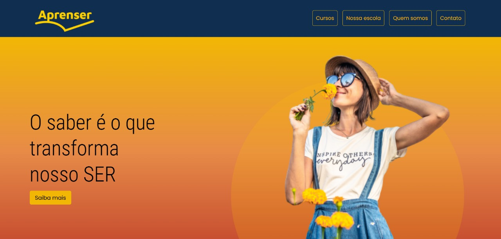

# Aprenser 💻

## Descriçao 📝
Minha solução do projeto proposto pelo curso Web Frontend Fundamentos. É um projeto simples, uma página estática feita com HTML e CSS com algumas pequenas animações. Projeto totalmento desenvolvido para fins de estudos e práticas.

## Sobre o projeto 🛠️
Exibição estática de uma página web que simula uma plataforma de cursos online de tecnologia. Nesse projeto pude praticar:
- HTML: estrutura das tags semânticas, referência das classes para os elementos.
- CSS: aplicação do método flexbox, uso de medidas relativas como: rem e em, utilização da propriedade transition em cada card, utilização do elemento position para posicionar as imagens e conteúdo de cada curso e o scale para redmensionar a imagem conforme o passar do mouse.

## Tecnologias utilizadas 🤖
- HTML
- CSS

## Deploy 🌐
Para fazer o deploy desse projeto utilizei o Netlify, link:
- [Acessar projeto](https://projetoaprenser.netlify.app)