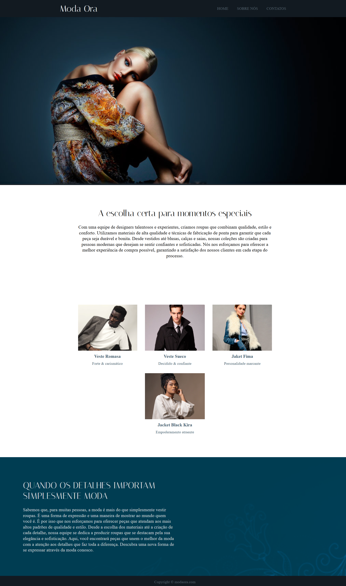

# Projeto Moda Ora 🖥️

## Descriçao 📝
Minha solução do projeto proposto pelo curso do Daniel Tapias, Web Frontend Fundamentos.
É um projeto simples, uma página estática feita com HTML e CSS para fins de estudo e práticas. Simula uma página web de um site. Nesse projeto pude praticar HTML: tagas semânticas e CSS: criação de variáveis, aplicação do método flexbox, uso de medidas relativas como: rem e % e adição de imagem pelo CSS.

## Sobre o projeto 🛠️
Exibição estática de uma página web que simula um site de moda, nele é mostrado informações sobre a marca.

## Tecnologias utilizadas 🤖
- HTML5
- CSS3

## Deploy 🌐

Para fazer o deploy desse projeto utilizei o Netlify  
[Visualizar](https://modaora.netlify.app)

