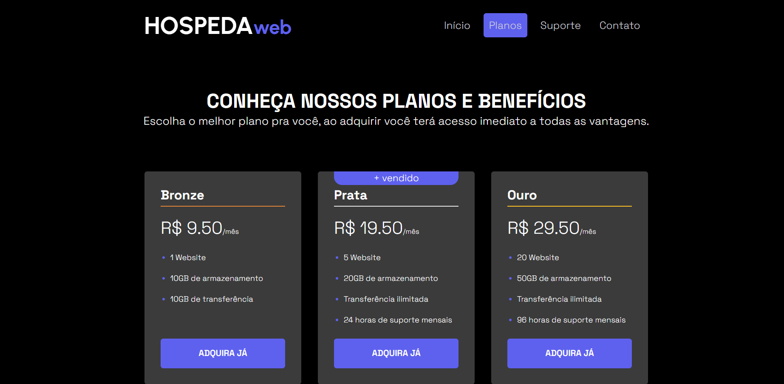

# Projeto HospedaWeb 🖥️

## Descriçao 📝
Minha solução do projeto proposto pelo curso do Daniel Tapias, Web Frontend Fundamentos.
É um projeto simples, uma página estática feita com HTML e CSS para fins de estudo e práticas do CSS. Nesse projeto pude praticar HTML: tagas semânticas e CSS: estilizações e aplicação do método flexbox.

## Funcionalidades 🛠️
Exibição estática de uma página web que simula um site de hospedagem para páginas web e é mostrado em cards as informações de cada plano oferecido pelo servidor.

## Tecnologias utilizadas 🤖
- HTML5
- CSS3

## Acesso ao projeto 🌐