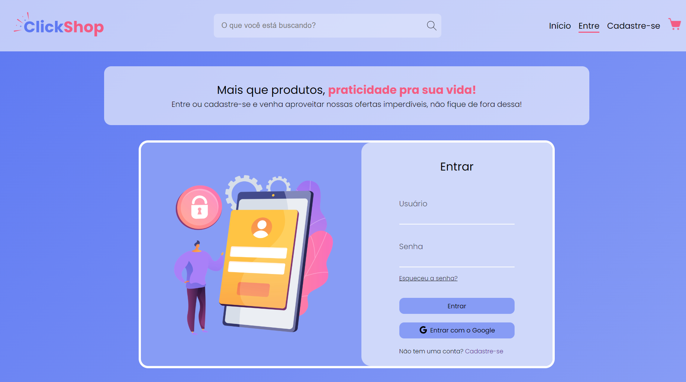
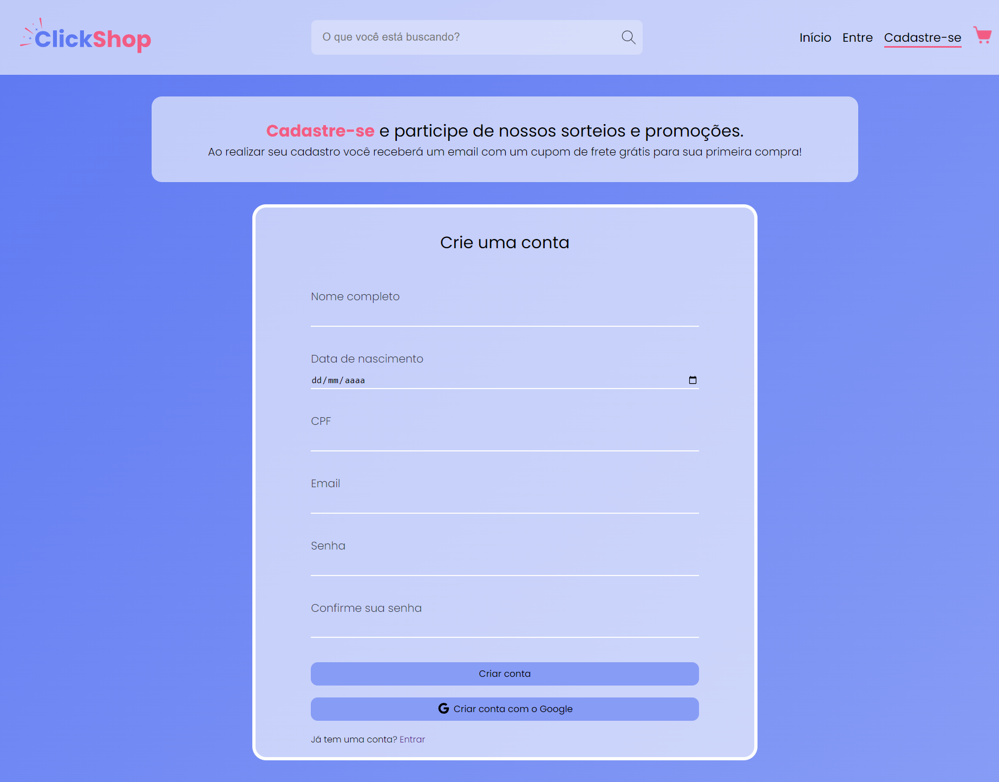

# ClickShop 💻

## Descriçao 📝
Meu projeto de tela de login e cadastro. É um projeto simples, uma página estática feita apenas com HTML e CSS. Projeto totalmento desenvolvido para fins de estudos e práticas.

## Sobre o projeto 🛠️
Exibição estática de uma página web que simula um site de vendas de produtos, com foco total na tela de login e cadastro. Nesse projeto pude praticar:
- HTML: estrutura das tags semânticas, referência das classes para os elementos.
- CSS: aplicação do método flexbox, uso de medidas relativas, formulário para tela de login e cadastro e uso do atributo pattern.
## Tecnologias utilizadas 🤖
- HTML
- CSS

## Deploy 🌐
Para fazer o deploy desse projeto utilizei o Netlify, link:
- [Acessar projeto](https://projetoclickshop.netlify.app)